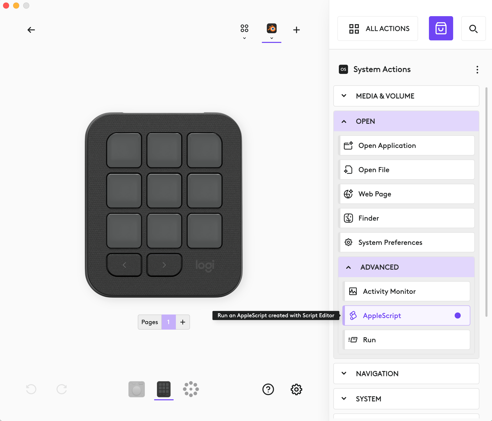
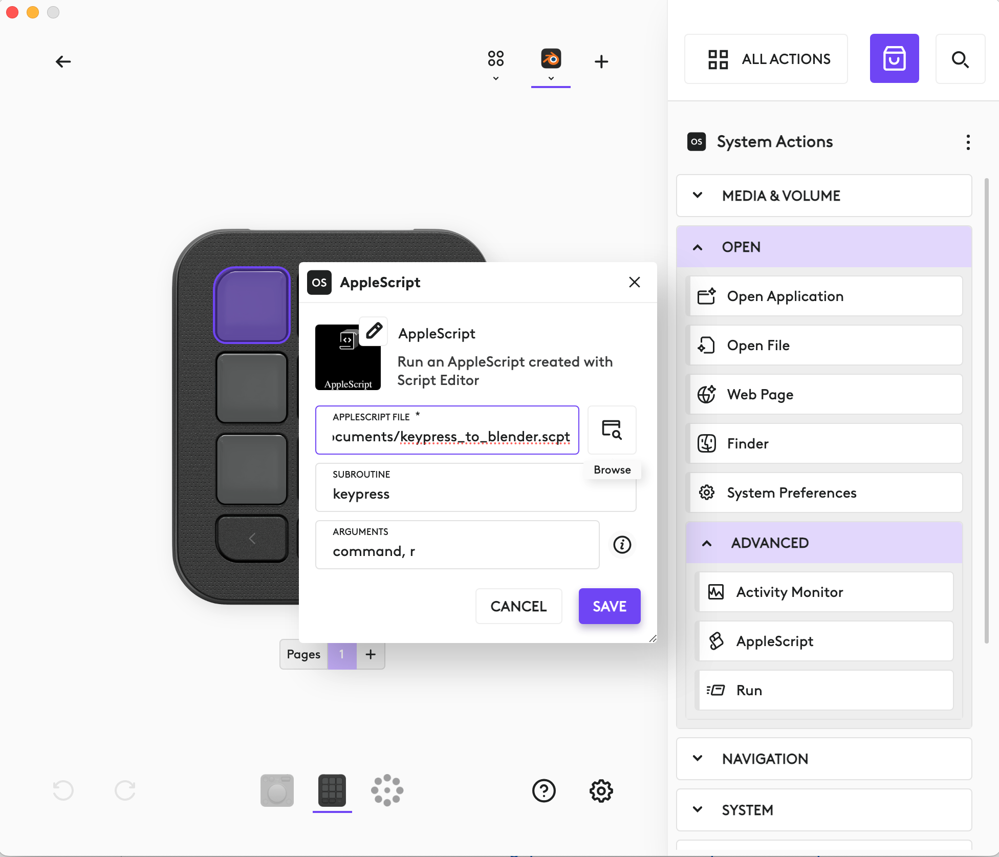

# Using Blender with Logitech MX Creative Console on MacOS
Logitech Creative Console has the potential to dramatically boost your workflow while working in Blender. Unfortunately, Logi Option+ on MacOS (as of version 1.86.669369) doesn't correctly send modifier keys (Command, Control, etc.) to Blender.

Hopefully, Logitech will fix the issue or someone will create a Profile in the Logi Marketplace.

Being the impatient person that I am, I came up with a solution using AppleScript that accepts parameters to send the key and modifier(s) to Blender.

## Usage

1. Download [keypress_to_blender.scpt](keypress_to_blender.scpt) to your Mac.

2. In Logi Options+ , locate the open AppleScript option and drag it to the button you want to configure.

3. Configure AppleScript. 
- AppleScriptFile: Path to the downloaded __keypress_to_blender.scpt__
- subroutine: __keypess__
- parameters: \<modifiers>, \<keypress>
  - \<modifiers> can be __control__, __option__, __command__, __shift__ or any combination (note: use lower case)
  - \<keypress> will be a single character or __spacebar__, __tab__

  - Example parameters: "command, r", "control option, q", "control, tab"

4. Hit Save and you've now configured a key to send a keypress + modifier to Blender. 

Of course, you'll probably want to edit the icon and text label to make the button more meaningful and aesthetically pleasing.
